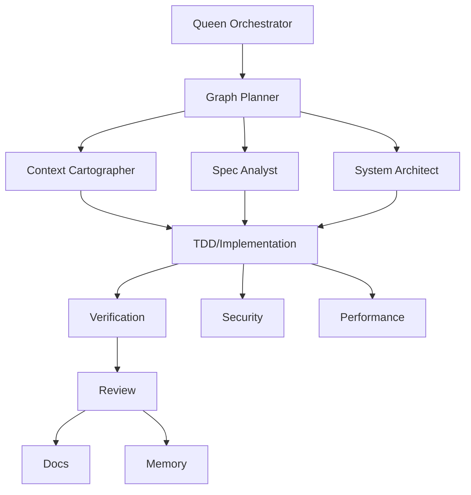

# Parallel Orchestration

Use this skill to run work as a coordinated swarm instead of a single linear pass. Prefer a visible node map for non-trivial goals.

## Core Pattern

1. Define the goal, constraints, and acceptance criteria.
2. Build an agent node map with topology, dependencies, and verification signals.
3. Assign lane roles: Thinker for hypotheses/designs, Worker for bounded execution, Verifier for falsification/review, Reducer for synthesis, and Coordinator for nested subgraphs.
4. Split independent questions into narrow lanes with unique mission hashes.
5. Launch lanes concurrently whenever their work does not overlap.
6. Synthesize evidence into one implementation path.
7. Execute the smallest correct change.
8. Verify with targeted commands.
9. Review the result before final response.

## Adaptive Coordination

- Solve directly when the task is simple; do not swarm by default.
- Use a Thinker/Worker/Verifier triad for uncertain coding tasks where one plan, one executor, and one falsifier are enough.
- Use map-reduce when many independent search spaces exist.
- Use debate only for genuinely competing designs.
- Use recursive/nested delegation only when the child graph has a distinct mission, bounded depth, and a reducer output.
- Change role mix, model, or topology after repeated same-cause failure; do not retry the same lane shape indefinitely.
- In portfolio mode, shard first by project id/root, then by subsystem. Keep separate manifests and verification gates per project so one project's success does not hide another project's risk.
- In standing max-autonomy mode, continuously refill the backlog from missing knowledge, unverified assumptions, TODO/FIXME, tests, docs, security surfaces, performance hotspots, dependency drift, and prior wave residual risks.

## Good Lanes

- Thinker lane: proposes hypotheses, plans, or design alternatives.
- Architecture lane: maps the relevant files, APIs, and data flow.
- Convention lane: finds local style, patterns, and tests.
- Risk lane: searches for edge cases, security issues, and regressions.
- Implementation lane: applies a tightly scoped change.
- Verification lane: runs tests/builds/reproduction and diagnoses failures.
- Review lane: inspects the final diff for defects and missing verification.
- Reducer lane: collapses evidence, deduplicates mission-hash collisions, and selects the next action.

## Loop Discipline

- Use bounded loops with explicit stop conditions.
- Each iteration should have one concrete action and one verification signal.
- Continue only when new evidence justifies another iteration.
- Do not ask for approval. Continue only when the next action is in scope and evidence-based; otherwise stop and report the smallest scoped next action.

## Parallelism Discipline

- Do not launch multiple agents to do the same work.
- Do not edit the same files from multiple lanes at once.
- Prefer read-only agents for discovery and review.
- Return synthesized conclusions, not a pile of separate reports.
- Mix independent roles or model families for high-confidence decisions instead of duplicating the same prompt.

## Max-Wave Discipline

- Use wave-batched map-reduce when the request asks for max swarm, massive fan-out, 1000 agents, benchmark-scale review, or multi-wave execution.
- Treat 1000 agents as a logical run capacity across bounded waves, not a reason to duplicate work. Keep each graph/tool wave at or below 512 nodes and prefer 128-256 planned read-only lanes, staged in micro-batches of about 32, when usage is green.
- Maintain a wave manifest: run id, wave id, node ids, mission hashes, file-ownership zones, model/cost class, dependencies, verification signal, status, and reducer output.
- Barrier after every wave: synthesize, deduplicate mission-hash collisions, audit edits against zones, then plan the next wave only if new independent work remains.
- Use two-tier reduce for waves above about 32 lane outputs: shard reduction with GLM 5.2, then GPT-5.5-fast final synthesis over shard summaries.
- Editing remains one writer per file-ownership zone regardless of swarm size.

## Best Default Graph

